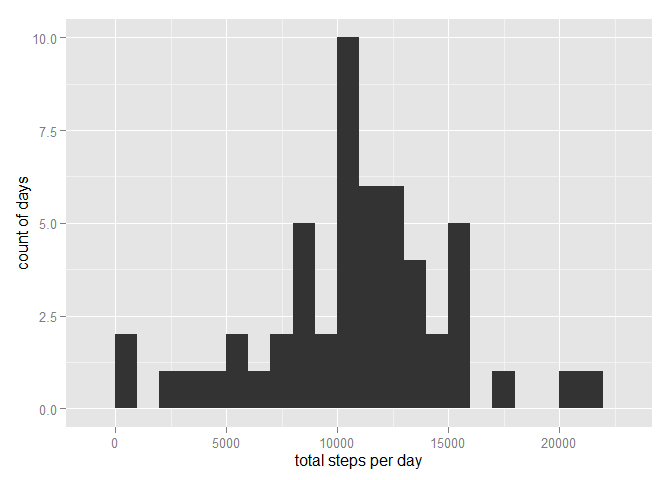
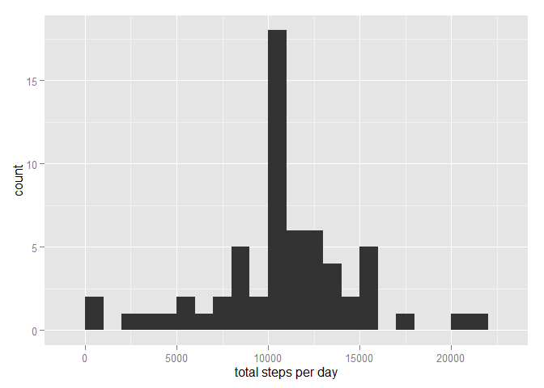

# Reproducible Research: Peer Assessment 1


## Data
This assignment makes use of data from a personal activity monitoring device. 
This device collects data at 5 minute intervals throughout the day. 
The data consists of two months of data from an anonymous individual collected 
during the months of October and November, 2012 and include the number of steps 
taken in 5 minute intervals each day.  

The data for this assignment can be downloaded from the course web site:

* Dataset: [Activity monitoring data](https://d396qusza40orc.cloudfront.net/repdata%2Fdata%2Factivity.zip)  

The variables included in this dataset are:  
* **steps:** Number of steps taking in a 5-minute interval (missing values are coded as NA)  
* **date:** The date on which the measurement was taken in YYYY-MM-DD format  
* **interval:** Identifier for the 5-minute interval in which measurement was taken  

The dataset is stored in a comma-separated-value (CSV) file and there are a 
total of 17,568 observations in this dataset.  

## Loading and preprocessing the data
The first step is to load the data.  This script assumes the code has been
unziped into a repro_p_1 directory under the working directory. After loading
the file, the Date field is converted from Factor to Date type.  


```r
readfile <- paste(getwd(),"/repro_p_1", "/", "activity.csv", sep="")
activity.df <- read.csv(readfile, header=TRUE)
activity.df$date <- as.Date(activity.df$date, format = "%Y-%m-%d")
```


## What is mean total number of steps taken per day?
Addressing this question requires summing the steps for each day and then
plotting the results.  It also includes calculating the mean and median
values for the daily totals.  Since steps are measured in whole steps, 
the mean value is rounded to the nearest whole number.  


```r
library(ggplot2)
options(scipen = 1, digits = 2)
steps.day <- aggregate(x=list(steps=activity.df$steps),
                            by=list(date=activity.df$date),
                            FUN=sum)

qplot(steps.day$steps, binwidth=1000, xlab="total steps per day", 
      ylab="count of days")
```

 

```r
steps.mean <- mean(steps.day$steps, na.rm=TRUE)
steps.mean <- round(steps.mean, digits = 0)
steps.median <- median(steps.day$steps, na.rm=TRUE)
```

* The **mean** number of steps per day is 10766 (rounded to whole steps)  
* The **median** number of steps per day is 10765

## What is the average daily activity pattern?
Addressing this question requires summing each 5 minute interval across all
days and plotting the results.  Also, the interval that has the highest
average number of steps and the number of steps for that interval is
identified.  


```r
steps.interval <- aggregate(x=list(mean.steps=activity.df$steps),
                      by=list(interval=activity.df$interval),
                      FUN=mean, na.rm=TRUE)

ggplot(data=steps.interval, aes(x=interval, y=mean.steps)) +
        geom_line() +
        xlab("5-minute interval") +
        ylab("average number of steps taken")
```

 

```r
max.interval <- steps.interval[which.max(steps.interval$mean.steps),]
max.interval$mean.steps <- round(max.interval$mean.steps, digits = 0)
```

The interval with the maximum average number of steps is
**835** with and average of 
**206** steps.

## Imputing missing values
There are a number of intervals where the number of steps is missing.  The
number of impacted records needs to be counted and then the missing values need to be addressed.  
  

```r
na.steps <- sum(is.na(activity.df$steps))
```
  
There are **2304** intervals with missing values.  
  
This analysis addresses missing values by replacing them with the mean number
of steps for that interval.  This is done by:  
* Merging the average steps per interval with the original data into a new dataframe  
* Sorting it back into its original order  
* Rounding the averages to whole steps  
* Replacing the NA values with the mean value  
  
Once the data is imputed, the results are plotted and mean and median values calculated.  


```r
options(scipen = 1, digits = 2)
impute.df <- merge(activity.df, steps.interval, by = "interval", sort = FALSE)
impute.df <- impute.df[with(impute.df, order(date, interval)), ]
impute.df$mean.steps <- round(impute.df$mean.steps, digits = 0)
impute.df$steps[is.na(impute.df$steps)] <-
        impute.df$mean.steps[is.na(impute.df$steps)]

impute.steps.day <- aggregate(x=list(steps=impute.df$steps),
                       by=list(date=impute.df$date),
                       FUN=sum)
qplot(impute.steps.day$steps, binwidth=1000,
      xlab="total steps per day")
```

 

```r
impute.mean <- mean(impute.steps.day$steps, na.rm=TRUE)
impute.mean <- round(impute.mean, digits = 0)
impute.median <- median(impute.steps.day$steps, na.rm=TRUE)
```

* Imputing shifted the **mean** to 10766 from 10766  
* Imputing shifted the **median** to 10762 from 10765 


## Are there differences in activity patterns between weekdays and weekends?
Addressing this question requires seperating weekday from weekend days.
This is done by:  
* Assigning the day of the week for each date  
* Assigining weekday/weekend values for each day    


```r
impute.df$weekdays <- factor(format(impute.df$date, "%A"))
levels(impute.df$weekdays) <- list(weekday = c("Monday", "Tuesday", "Wednesday", 
                                                "Thursday", "Friday"),
                                  weekend = c("Saturday", "Sunday"))
```
  
The results are then plotted  


```r
interval.weekday <- aggregate(impute.df$steps, by = list(impute.df$weekdays, 
                                                         impute.df$interval), 
                           FUN=mean, na.rm = TRUE, na.action = NULL)
colnames(interval.weekday) <- c("weekday", "interval", "mean.steps")


library(lattice)
xyplot(interval.weekday$mean.steps ~ interval.weekday$interval | 
               interval.weekday$weekday, layout = c(1, 2), type = "l",
       xlab = "Interval", 
       ylab = "Number of steps")
```

 

